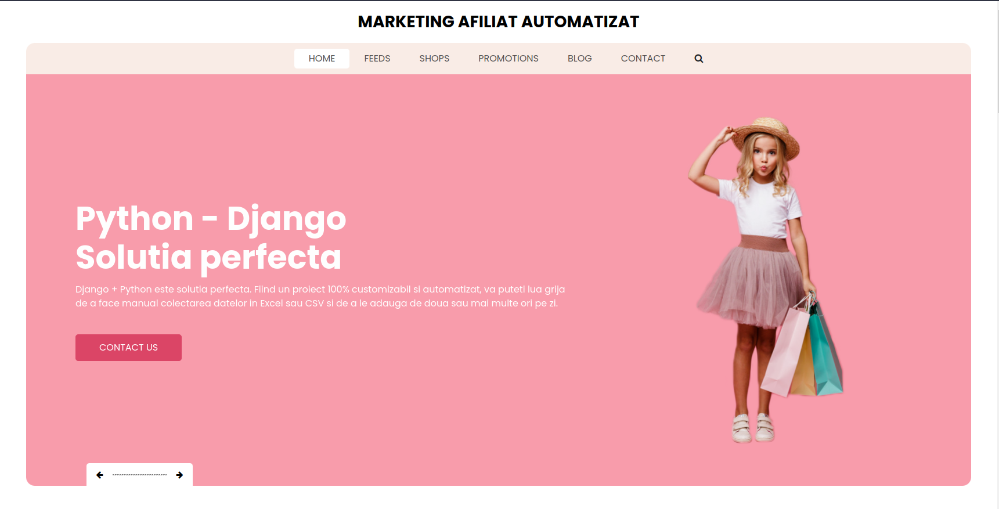

# Proiectul de Marketing Afiliat Automatizat

Video presentation:

Acest proiect este o aplicație web dezvoltată cu Django care automatizează marketingul afiliat și actualizarea produselor afiliate.

1. [Introducere](#introducere)
2. [Configurarea Mediului de Dezvoltare](#configurarea-mediului-de-dezvoltare)
3. [Structura Proiectului](#structura-proiectului)
4. [Modele de Date](#modele-de-date)
5. [Template-uri](#template-uri)
6. [Procesarea Produselor Afiliate](#procesarea-produselor-afiliate)
7. [Sincronizarea automată a Produselor](#sincronizarea-automata-a-produselor)
8. [Încheiere](#incheiere)
